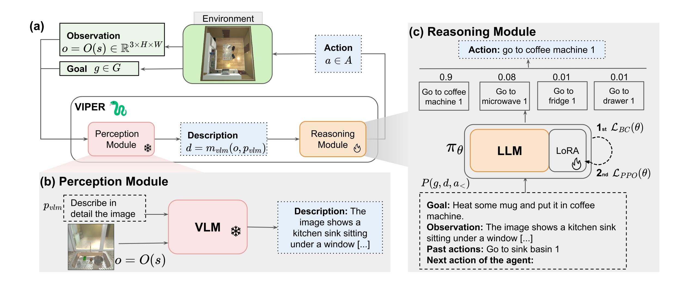

# VIPER-Visual-Perception-and-Explainable-Reasoning-for-Sequential-Decision-Making
This repository is the official implementation of the VIPER paper.

## ABSTRACT

While Large Language Models (LLMs) excel at reasoning on text and Vision-Language Models (VLMs) are highly effective for visual perception, applying those models for  visual instruction-based planning remains a widely open problem. 
In this paper, we introduce \textbf{VIPER}, a novel framework for multimodal instruction-based planning that integrates VLM-based perception with LLM-based reasoning. Our approach uses a modular pipeline where a frozen VLM generates textual descriptions of image observations, which are then processed by an LLM policy to predict actions based on the task goal. We fine-tune the reasoning module using behavioral cloning and reinforcement learning, improving our agent's decision-making capabilities.
Experiments on the ALFWorld benchmark show that \textbf{VIPER} significantly outperforms state-of-the-art visual instruction-based planners while narrowing the gap with purely text-based oracles.  By leveraging text as an intermediate representation, \textbf{VIPER} also enhances explainability, paving the way for a fine-grained analysis of perception and reasoning components.

## To-Do List  
- [x] Setup the repository  
- [x] Code Release
- [ ] Documentation
- [ ] Docker Release
- [ ] release BC Dataset
- [ ] Demonstration

## Setup
### Create your conda environment

conda create -n viper python==3.9.0
conda activate viper

### Install Alfworld

    cd alfword/TextWorld
    pip install -e .[full]

    pip install torch==2.4.0 torchvision==0.19.0 torchaudio==2.4.0 --index-url https://download.pytorch.org/whl/cu118

    cd ..

    pip install -e .[full]
### Install lamorel
cd lamorel/lamorel
pip install -e .
pip install wandb gym peft bitsandbytes pyvirtualdisplay

### Download Alfworld data lamorel
    export ALFWORLD_DATA=<storage_path>
    alfworld-download

## Demonstration

