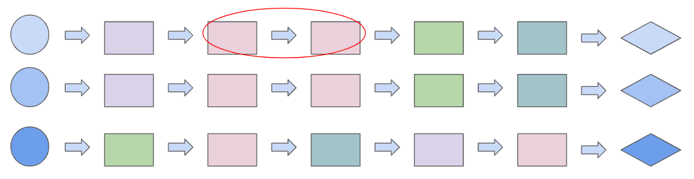

# Curiosity based RL training for LLM agents


## Setup
### Create your conda environment

    conda create -n viper python==3.9.0
    conda activate viper

### Install Alfworld

    cd alfworld/TextWorld
    ```
    conda install cython
    conda install numpy
    pip install --no-build-isolation -e .[full]
    ```

    pip install torch==2.4.0 torchvision==0.19.0 torchaudio==2.4.0 --index-url https://download.pytorch.org/whl/cu118

    cd ..

    pip install -e .[full]
### Install lamorel
    cd lamorel/lamorel
    pip install -e .
    pip install wandb gym peft bitsandbytes pyvirtualdisplay

### Download Alfworld episodes data and generate game files
    export ALFWORLD_DATA=<storage_path>
    alfworld-download
    alfworld-generate
    change data path in alfworld configs to your custom path

Find and run the scripts in `scripts` folder.

## Models used:
The current code is based on Llama - 1B model.

# Curiosity rewards:
Two types of novelty are rewarded:

1. **Action novelty (horizontal):**  
   To reduce action repetition from the LLM, actions that occur less frequently in a trajectory are rewarded more.

2. **Action patterns novelty (vertical):**  
   A novel sequence of actions is rewarded based on an auxiliary model loss (the *temporal predictor model*).



## Temporal Predictor

A T5 model is used as the temporal predictor, trained on the PPO buffer with the task of predicting the next action given the previous sequence of actions in the current trajectory.  
Its loss on new trajectories is used as the action pattern novelty reward.

